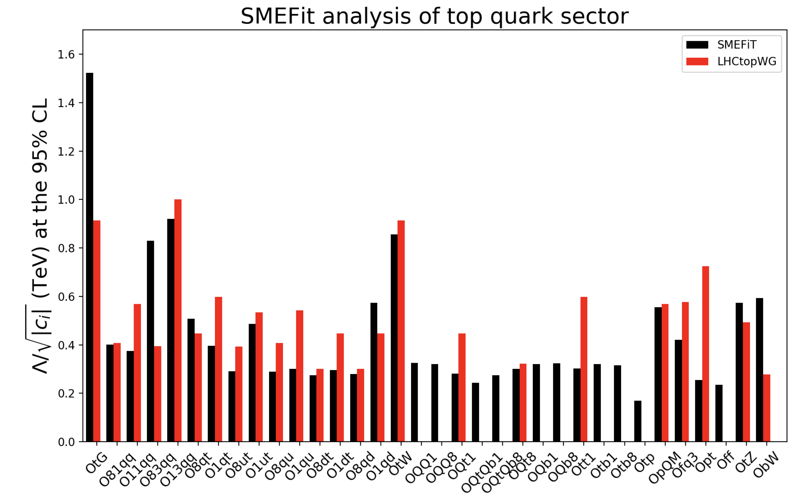

SMEFiT Top
==========

Here we present the results of the SMEFiT 2019  analysis of the top quark sector described in the following publication

- *A Monte Carlo global analysis of the Standard Model Effective Field Theory: the top quark sector*, N. P. Hartland, F. Maltoni, E. R. Nocera, J. Rojo, E. Slade, E. Vryonidou, C. Zhang, `arXiv:1901.05965 <https://inspirehep.net/literature/1714930>`_, `JHEP 04 (2019) 100 <https://link.springer.com/article/10.1007/JHEP04(2019)100>`_.

In this work we present a novel framework for carrying out global analyses of the Standard Model Effective Field Theory (SMEFT) at dimension-six: SMEFiT. This approach is based on the Monte Carlo replica method for deriving a faithful estimate of the experimental and theoretical uncertainties and enables one to construct the probability distribution in the space of the SMEFT degrees of freedom. As a proof of concept of the SMEFiT methodology, we present a first study of the constraints on the SMEFT provided by top quark production measurements from the LHC. Our analysis includes more than 30 independent measurements from 10 different processes at 8 and 13 TeV such as inclusive tt and single-top production and the associated production of top quarks with weak vector bosons and the Higgs boson. State-of-the-art theoretical calculations are adopted both for the Standard Model and for the SMEFT contributions, where in the latter case NLO QCD corrections are included for the majority of processes. We derive bounds for the 34 degrees of freedom relevant for the interpretation of the LHC top quark data and compare these bounds with previously reported constraints. Our study illustrates the significant potential of LHC precision measurements to constrain physics beyond the Standard Model in a model-independent way.

