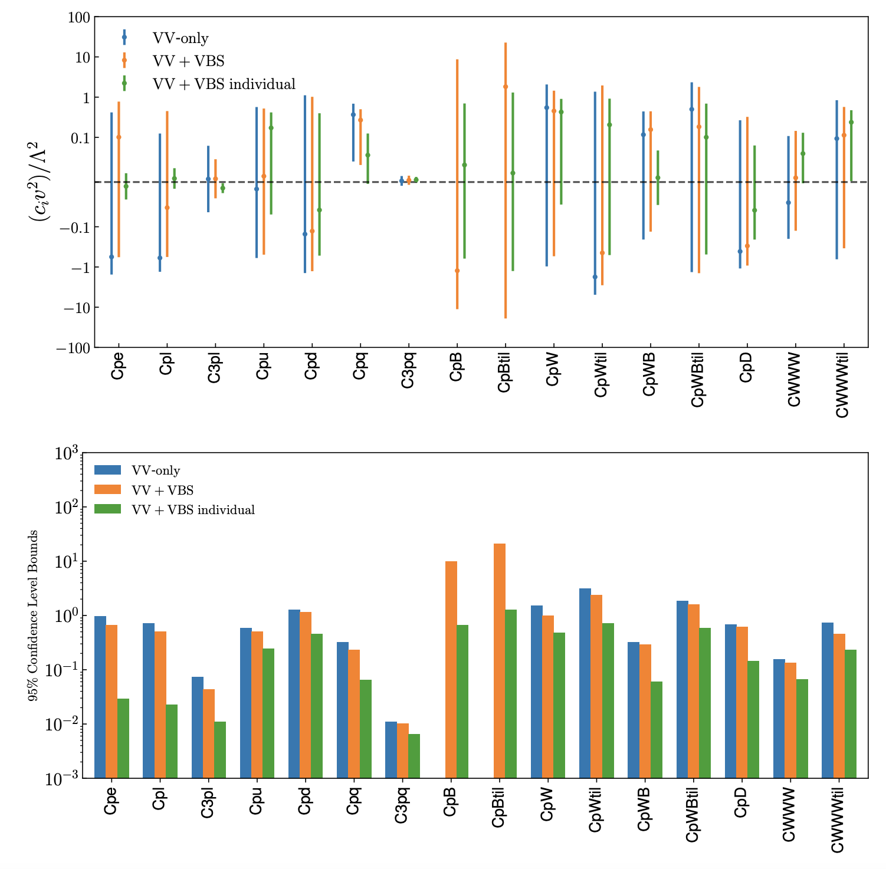

SMEFiT VBS
==========

Here we present the results of the SMEFiT analysis of **vector boson scattering** (VBS)
and diboson cross-sections from the LHC described in the following publication:

- *SMEFT analysis of vector boson scattering and diboson data from the LHC Run II* , J. Ethier, R. Gomez-Ambrosio, G. Magni, J. Rojo, :cite:`Ethier_2021`.

This work present a systematic interpretation of vector boson scattering (VBS) and diboson measurements from the LHC in the framework of the dimension-six SMEFT. We consider all available measurements of VBS fiducial cross-sections and differential distributions from ATLAS and CMS, in most cases based on the full Run II luminosity, and use them to constrain 16 independent directions in the dimension-six EFT parameter space. Compared to the diboson measurements, we find that VBS provides complementary information on several of the operators relevant for the description of the electroweak sector. We also quantify the ultimate EFT reach of VBS measurements via dedicated projections for the High Luminosity LHC. Our results motivate the integration of VBS processes in future global SMEFT interpretations of particle physics data.

In this page you find information about the input and results from this **EFT analysis of VBS data:**

- :ref:`SMEFiT VBS operator basis`
- :ref:`SMEFiT VBS CL intervals`
- :ref:`SMEFiT VBS Analysis code`
- :ref:`SMEFiT VBS Released fits`

.. _SMEFiT VBS operator basis:

Operator basis
~~~~~~~~~~~~~~

The EFT analysis presented in this work is based on the following operator basis, see Sect. 2 in the paper for the explicit definition of the various degrees of freedom and the flavour assumptions adopted. We categorize these EFT coefficients into four disjoint classes: four-quark (two-light-two-heavy), four-quark (four-heavy), two-fermion, and purely bosonic operators. Note that some of these coefficients are not independent but rather related among them via the EWPOs

In the table below we list the EFT coefficients considered in this work together with the notation used in the plots and in the output files associated to the analysis results.

.. list-table:: Operator basis
   :widths: 30 60 60
   :header-rows: 1

   * - Class
     - EFT Coefficient
     - Notation
   * - Purely bosonic (CP-even)
     - :math:`c_{\varphi B}`, :math:`c_{\varphi W}`, :math:`c_{\varphi W B}`, :math:`c_{\varphi D}`, :math:`c_{WWW}`
     - ``cpB``, ``cpW``, ``cpWB``, ``cWWW``
   * - Purely bosonic (CP-odd)
     - :math:`c_{\widetilde{W}}`, :math:`c_{\varphi \widetilde{W}}`, :math:`c_{\varphi \widetilde{B}}`, :math:`c_{\varphi \widetilde{W} B}`
     - ``cWWWtil``, ``cpWtil``, ``cpBtil``, ``cpWBtil``
   * - Two fermion
     - :math:`c_{\varphi l}^{(1)}`, :math:`c_{\varphi l}^{(3)}`, :math:`c_{\varphi q}^{(3)}`, :math:`c_{\varphi u}`, :math:`c_{\varphi d}`, :math:`c_{\varphi e}`
     - ``cpl``, ``c3pl``, ``cpq``, ``c3pq``, ``cpu``, ``cpd``, ``cpe``

.. _SMEFiT VBS CL intervals:

95% CL intervals
~~~~~~~~~~~~~~~~

Here we provide the 95\% CL intervals derived on the EFT coefficients that enter our analysis. We provide these results both when fitting all coefficients simultaneously (and then marginalising) as well as at the level of individual fits, where only one coefficient is varied and the rest are set to their SM values. These 95\% CL intervals have been determined assuming :math:`\Lambda=1~{\rm TeV}`, results for other values of :math:`\Lambda` can be obtained by rescaling.

.. _SMEFiT VBS Analysis code:

Analysis code
~~~~~~~~~~~~~~

The **posterior probability distributions** corresponding to all the fits presented in this work are made available in the `SMEFiT GitHub public repository <https://github.com/LHCfitNikhef/SMEFiT/>`_, together with Python analysis code to process them and produce a range of statistical estimators. For instance, upon choosing a given fit (see :ref:`SMEFiT VBS Released fits`), whose output is constitured by :math:`N_{\rm spl}` posterior samples for the :math:`n_{\rm op}=49` EFT coefficients considered in this analysis, the analysis code can evaluate  **statistical estimators** such as means, standard deviations, and correlations, as well as other estimators such as confidence level intervals and higher moments beyond the parabolic approximation, see :ref:`SMEFiT VBS Analysis code` for more details.

.. _SMEFiT VBS Released fits:

Released fits
~~~~~~~~~~~~~

The list of fits that are made available with this release of the SMEFiT VBS+diboson analysis are summarised
in the table below:

.. list-table:: SMEFiT VBS fits
   :widths: 30 30 30 30
   :header-rows: 1

   * - Descriptor
     - Dataset
     - Theory settings
     - Methodology
   * - `Baseline <https://github.com/LHCfitNikhef/SMEFiT/tree/master/VBS_SMEFiT/NS_VV_VBS_Fit_LO_NHO>`_
     - VBS+VV
     - LO QCD in EFT + :math:`\mathcal{O}(\Lambda^{-2})`
     - Default
   * - `Diboson-only <https://github.com/LHCfitNikhef/SMEFiT/tree/master/VBS_SMEFiT/NS_Diboson_LO_NHO>`_
     - Only VV data used as input
     - LO QCD in EFT + :math:`\mathcal{O}(\Lambda^{-2})`
     - Default
   * - `VBS-only <https://github.com/LHCfitNikhef/SMEFiT/tree/master/VBS_SMEFiT/NS_VBS_LO_NHO>`_
     - Only VBS data used as input
     - LO QCD in EFT + :math:`\mathcal{O}(\Lambda^{-2})`
     - Default
   * - `HL-LHC <https://github.com/LHCfitNikhef/SMEFiT/tree/master/VBS_SMEFiT/NS_VBS_HL_LO_NHO>`_
     - Only VBS data for HL-LHC projections used as input
     - LO QCD in EFT + :math:`\mathcal{O}(\Lambda^{-2})`
     - Default

.. important::

  the coefficients ``cpe``, ``cpl``, ``c3pl``, ``cpu``, ``cpd``, ``cpq``, ``cpq3``
  here follow the SMEFiT2.0 notation to have a consistent delivery code, but they are not exactly the very same.
  They are matched (whit a small notation abuse) to SMFiT2.0 basis through the relations:

  ``cpe = cpe``, ``cpl = cpl1``, ``c3pl = c3pl1``

  ``cpu = cpui``, ``cpd = cpdi``, ``cpq = cpqi``, ``cpq3 = cpq3``.

  In this work the two fermion coefficients are the average of the the flavourful coefficients.
  In paricular the leptonc coefficients: ``cpe``, ``cpl1`` and ``c3pl1`` result to be the same as one of
  the corresponding dof of SMEFiT2.0 since in that paper flavour symmetry is applied through EWPO.
  While ``cpui``, ``cpdi``, ``cpqi``, ``cpq3`` are matched to the light corresponding SMEFiT2.0 coefficients
  since :math:`t,b` quark do not contribute any role in VBS, VV process.

For more information, see the different flavour assumptions of SMEFiT2.0 paper and VBS_SMEFiT paper.

.. important::
  To facilitate the comparison, posterior distribution are given with the same SMEFiT2.0 normalization:
  the resulting bounds are for :math:`c_i/\Lambda^2` while in :cite:`Ethier_2021` bounds are given as
  :math:`c_i v^2/\Lambda^2`

Requests for variants of these fits should be addressed to the **SMEFiT authors**.
